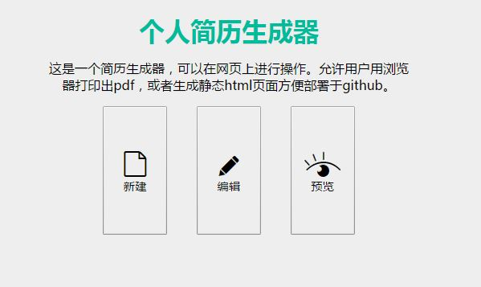
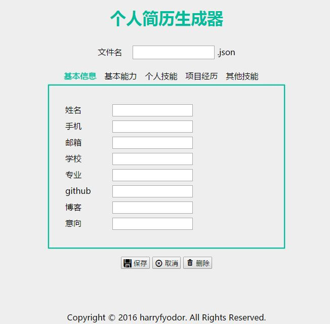
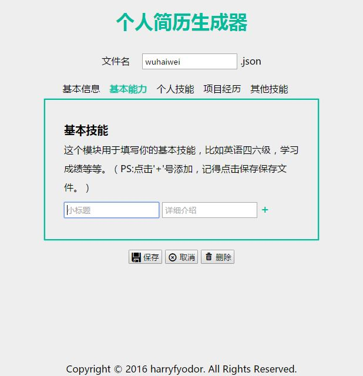
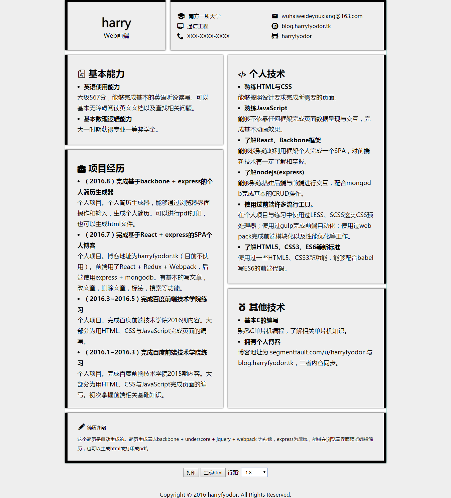

# 个人简历生成器

> 个人简历生成器。通过浏览器界面来操作本地数据，展现数据。

### 最终简历的`demo`如下

主页


填写内容


填写内容（类似todos）


简历样例


### 功能描述

* 新建简历。通过`html`表单输入简历相关信息。并把简历相关信息保存为`json`文件，保存于本地。

* 编辑简历信息。通过浏览器界面修改简历相关的`json`文件。

* 预览简历。可以把简历打印成`pdf`，或者生成相应`html`文件。这个`html`文件可以在本地直接打开，可以方便部署于`github page`。部署`github page`很简单，可以参照这个教程。

### 技术描述

* 前端使用 `backbone` + `underscore` + `jquery` + `webpack`, 后端使用 `nodejs`。

* 前端模块化使用CMD标准，而非大部分教程直接用`<script>`引入。

* 前端使用`ajax`(使用`jquery`)收发数据。

* 后端使用`express`框架，用`json`存储数据。

### 使用方法

* `clone`本`repo`于本地。

* 在终端输入
```
npm install
npm start
```
安装依赖并开启。此时浏览器打开`localhost:3000`可以看到界面。
  
* 生成的`json`文件会最终放置于根目录的data文件夹。

* `html`静态文件会生成在`output`文件夹。该文件夹里的所有内容可以使用于`github page`。


